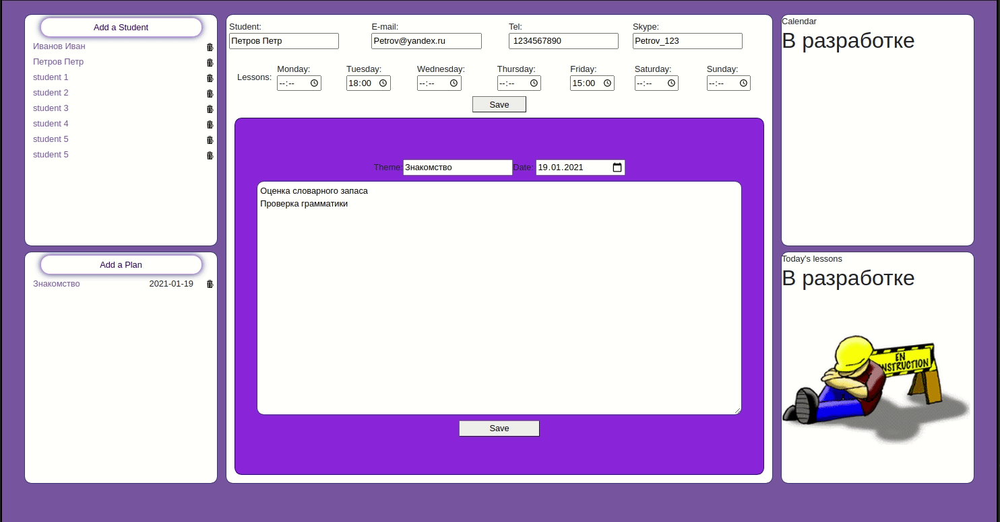

# Планировщик уроков
## Данное приложение создано для того, чтобы помочь репетиторам планировать свой день.
## Стэк - HBS, Express js, MongoDB Atlas, HTML, CSS, API Яндекс переводчик.
### Разработчик:
- [Александр П.](https://github.com/PapakhinAV)

### Приложение позволяет:
- Благодаря приложению репетиторы могут создавать и хранить планы уроков для каждого ученика в одном месте, а также комментарии по результатам занятий.

## Для запуска проекта
- Склонировать проект
- Инициализировать проект в корневой папке - npm i
- В корневой папке создать файл .env (информация у автора проекта)
- Запустить проект из корневой папки - npm start
#
### Переводчик
- На стартовую страницу приложения интегрирован Яндекс переводчик.

#
## Возможности приложения
### `Регистрация юзера`
- Каждый юзер может зарегистрироваться указав свои данные, а также режактировать свой профиль.
#
### `Добавление учеников`
- Пользователь может добавлять учеников и для каждого ученика создавать и редактировать отдельные планы уроков. Также пользователь может указывать в какие дни и во сколько запланированы занятия с конкретным учеником.

#
### Планы развития приложения
- Добавить автоматически формируемый календарь, который будет показывать запланированные на сегодня уроки

